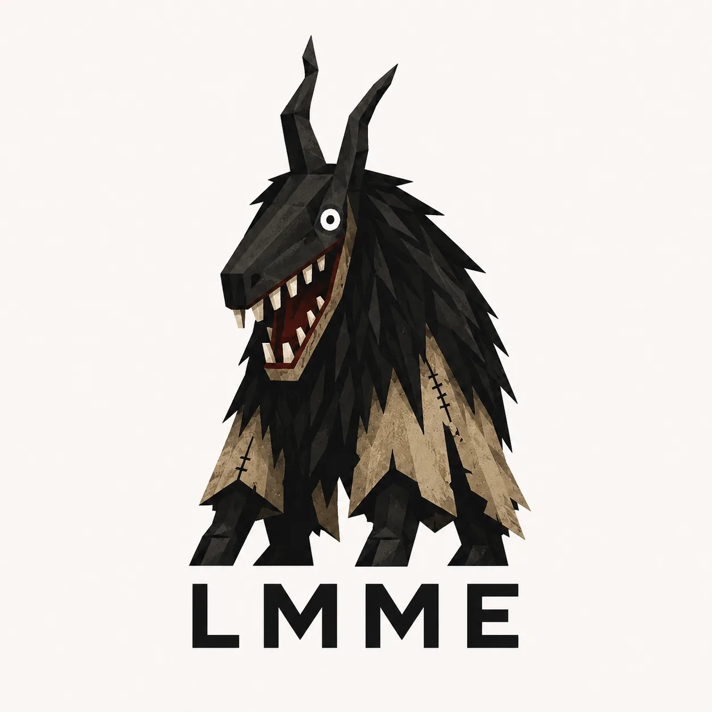

# LowMemoryMarkdownEditor

<p align="center">
  
</p>

Small Linux-only GTK Markdown editor focused on low memory usage and local folders.

## What it does

- opens a local folder as a workspace
- shows folders, Markdown files and images
- edits Markdown files with GtkSourceView
- supports tabs
- supports autosave and manual save
- preserves unsaved recovery data during shutdown and restores it to the original Markdown path
- keeps recovery inspection non-destructive when metadata is missing or corrupt
- shows `Recovery failed` alongside `Modified`, `Conflict`, or `Deleted` without hiding disk state
- blocks destructive reload/close choices until current local contents are saved, recovered, or explicitly discarded
- detects external file changes without a time-based ignore window
- toggles between Source and single-pane Editable Preview styling
- supports editor font zoom with Ctrl++, Ctrl+-, Ctrl+0, and numpad variants
- supports image insertion into a workspace-level `img` folder
- uses lightweight system GTK symbolic icons for toolbar, tabs, and file tree
- provides a right-click context menu for workspace file tree actions
- scans workspace directories lazily as they are expanded
- uses a compact native dark GTK interface
- stores basic config in `~/.config/lmme/config.ini`

## What it does not do

- no Electron
- no WebEngine or WebView
- no cloud
- no plugins
- no graph
- no backlinks
- no PDF/HTML export
- no Mermaid/LaTeX rendering in v0.1

## Dependencies

```bash
sudo apt update
sudo apt install -y build-essential meson ninja-build pkg-config libgtk-4-dev libgtksourceview-5-dev
```

If your distribution names the pkg-config implementation `pkgconf`, install it too:

```bash
sudo apt install -y pkgconf
```

## Build

```bash
meson setup build
meson compile -C build
```

If `meson setup build` failed before all dependencies were installed, remove the incomplete build directory first:

```bash
rm -rf build
meson setup build
meson compile -C build
```

## Run

```bash
./build/lmme
```

## Tests

```bash
meson test -C build
```

## Development notes

UI language is English only.
Primary target is MX Linux / Debian-based systems.
Editable Preview is a same-buffer styling layer for Markdown source, not WYSIWYG or full GitHub Markdown rendering.

## Project structure

`src/app` contains application lifecycle and global state.
`src/ui` contains GTK layout, menus, toolbars, status bar and context menus.
`src/command` contains the command catalog, GTK action dispatch and shortcuts.
`src/document` contains document state, tabs, autosave, recovery and file monitoring.
`src/workspace` contains workspace scanning and file operations.
`src/editor` contains GtkSourceView setup, editing operations, search and preview logic.
`src/features` contains self-contained optional editor features such as image insertion.
`src/infra` contains config, dialogs, atomic writes and utility helpers.

## License

MIT.
